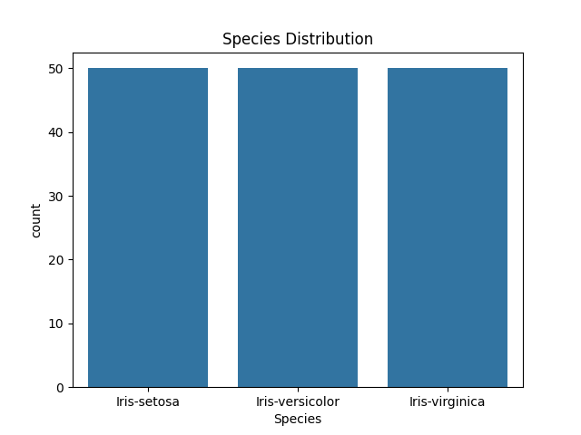
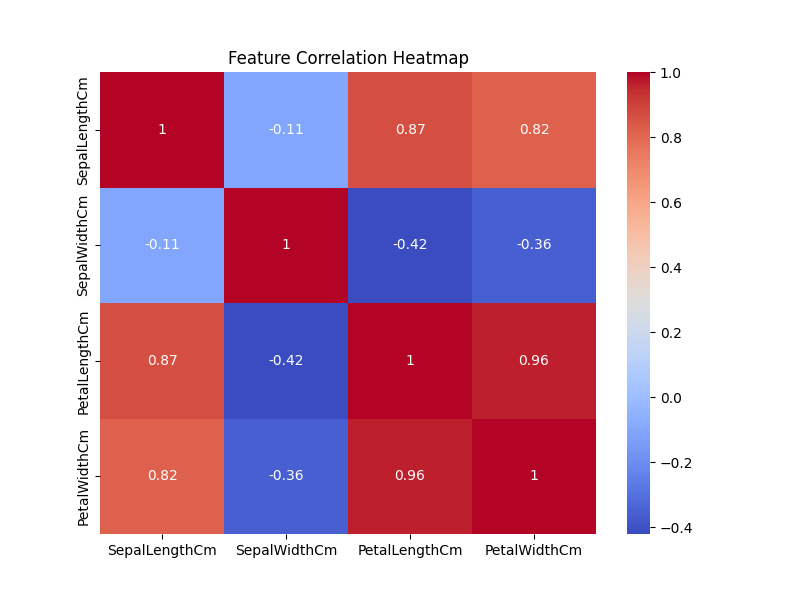
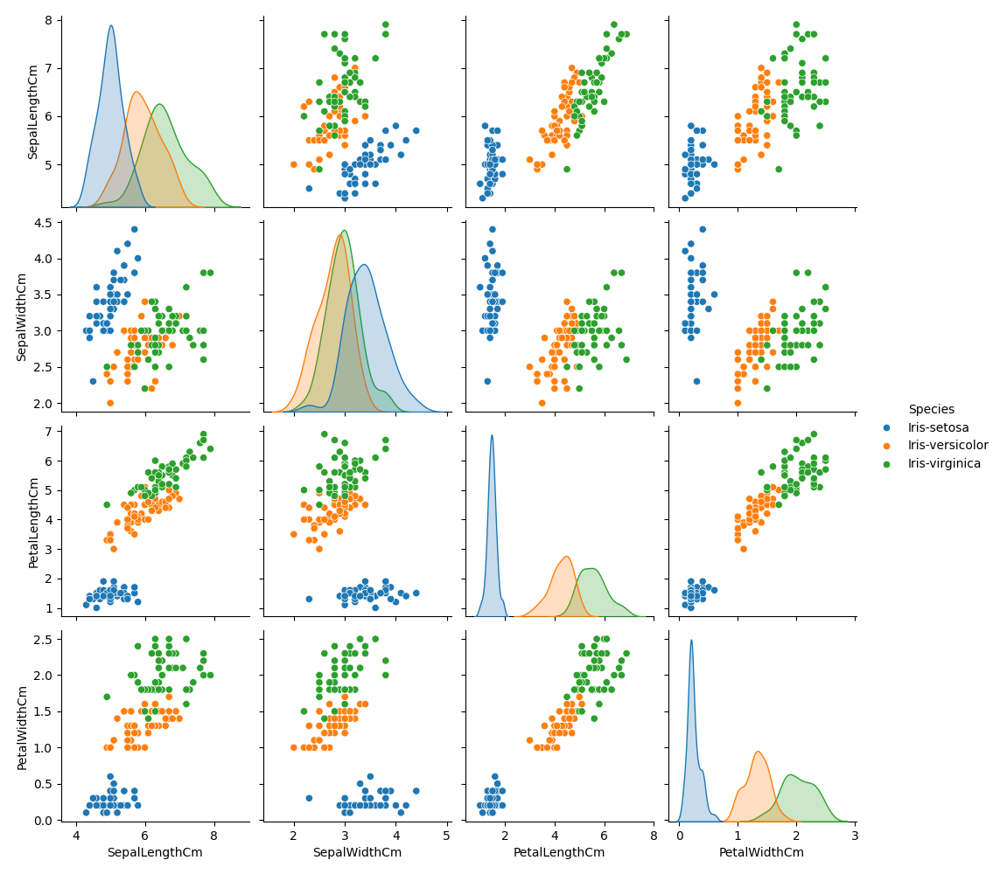
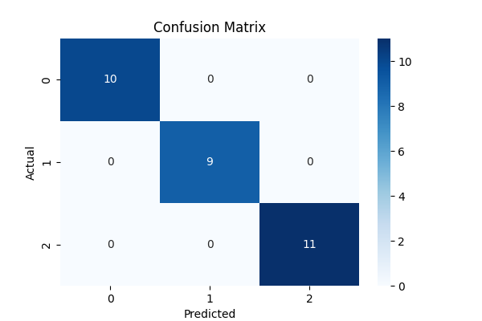

# Iris Flower Classification

## Objective

Build a machine learning model that classifies Iris flowers into:

- Iris-setosa
- Iris-versicolor
- Iris-virginica

using flower measurements.

## Technologies Used

- Python
- Pandas
- Numpy
- Matplotlib
- Searborn
- Scikit-learn

## Features

- Sepal Lenght 
- Sepal Width
- Petal Length
- Petal Width

## Model

Decision Tree Classifier

## Results

Model Accuracy: 1.0

## Visualizations

### Species Distribution

### Correlation Heatmap

### Pair Plot

### Confusion Matrix

